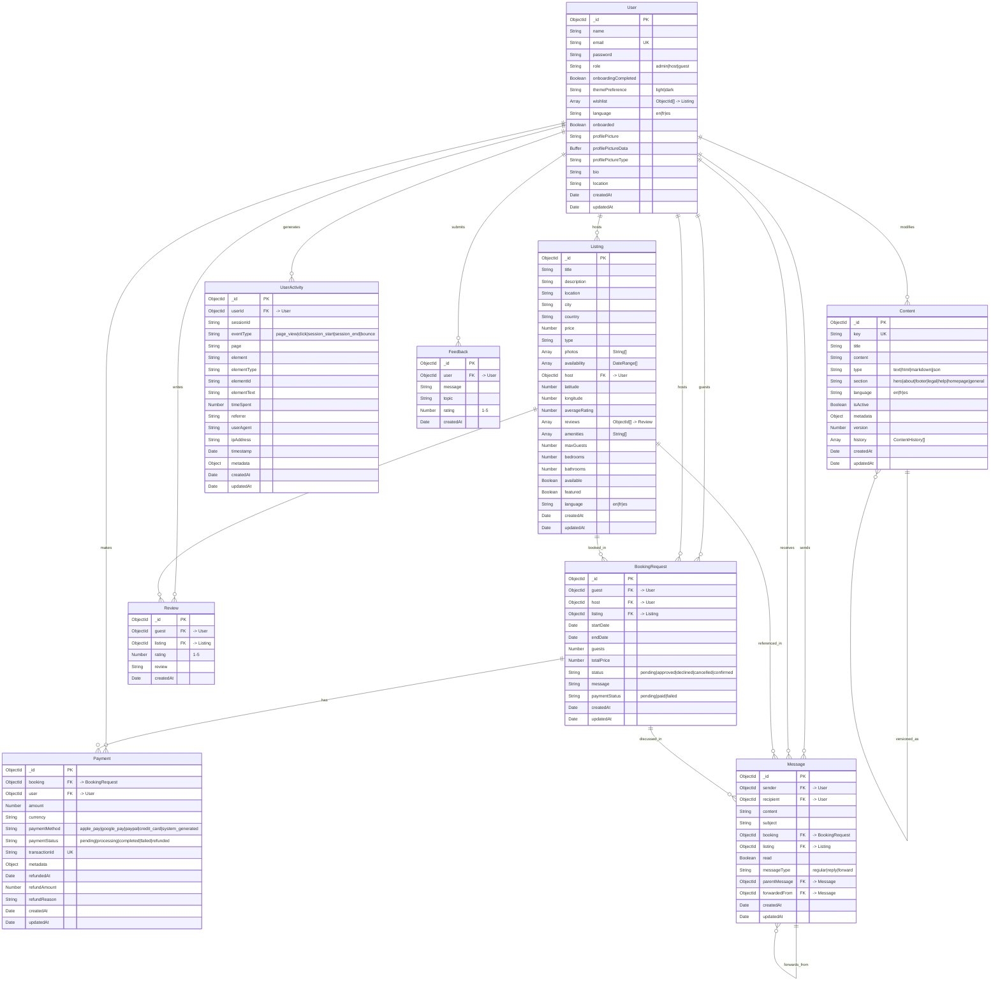

# nu3PBnB Database Schema Documentation

## Overview

The nu3PBnB application uses MongoDB with Mongoose ODM. The database schema is designed to support a comprehensive property booking platform with user management, messaging, payments, analytics, and content management.

## Database Schema Diagram

## Entity Relationships

### Core Entities

#### 1. **User** (Central Entity)
- **Purpose**: Represents all users in the system (guests, hosts, admins)
- **Key Features**: 
  - Role-based access control (admin, host, guest)
  - Multi-language support
  - Profile management with image uploads
  - Wishlist functionality
  - Theme preferences

#### 2. **Listing** (Property Entity)
- **Purpose**: Represents properties available for booking
- **Key Features**:
  - Geographic location with coordinates
  - Multi-language content
  - Photo galleries
  - Availability calendar
  - Amenities and property details
  - Rating system integration

#### 3. **BookingRequest** (Booking Entity)
- **Purpose**: Manages booking requests and confirmations
- **Key Features**:
  - Date range booking
  - Guest count management
  - Status tracking (pending, approved, declined, etc.)
  - Payment status integration

### Supporting Entities

#### 4. **Payment** (Financial Entity)
- **Purpose**: Handles all payment transactions
- **Key Features**:
  - Multiple payment methods
  - Transaction tracking
  - Refund management
  - Receipt generation

#### 5. **Message** (Communication Entity)
- **Purpose**: Enables communication between users
- **Key Features**:
  - Direct messaging
  - Booking-related conversations
  - Message threading (replies, forwards)
  - Read status tracking

#### 6. **Review** (Feedback Entity)
- **Purpose**: Manages property reviews and ratings
- **Key Features**:
  - Star rating system (1-5)
  - Text reviews
  - Guest-only reviews

#### 7. **Content** (CMS Entity)
- **Purpose**: Manages dynamic website content
- **Key Features**:
  - Multi-language content management
  - Version control with history
  - Section-based organization
  - Rich content types (HTML, Markdown, JSON)

#### 8. **UserActivity** (Analytics Entity)
- **Purpose**: Tracks user behavior for analytics
- **Key Features**:
  - Session tracking
  - Page view analytics
  - Click tracking
  - User journey analysis

#### 9. **Feedback** (Support Entity)
- **Purpose**: Collects user feedback and support requests
- **Key Features**:
  - Topic categorization
  - Rating system
  - Support ticket management

## Indexes and Performance

### Primary Indexes
- All collections have `_id` as primary key
- User: `email` (unique)
- Payment: `transactionId` (unique)
- Content: `key + language` (compound unique)

### Secondary Indexes
- UserActivity: `userId + timestamp`, `sessionId + timestamp`, `eventType + timestamp`
- Content: `section + language`, `isActive`
- Message: `sender + recipient`, `read status`
- Listing: `host`, `location`, `availability`

## Data Integrity Constraints

### Required Fields
- User: name, email, password, role
- Listing: title, description, location, city, country, price, type, host, coordinates
- BookingRequest: guest, host, listing, dates, guests, totalPrice
- Payment: booking, user, amount, paymentMethod
- Message: sender, recipient, content
- Review: guest, listing, rating

### Enumerated Values
- User roles: admin, host, guest
- Booking status: pending, approved, declined, cancelled, confirmed
- Payment status: pending, processing, completed, failed, refunded
- Payment methods: apple_pay, google_pay, paypal, credit_card, system_generated
- Languages: en, fr, es
- Content types: text, html, markdown, json

### Validation Rules
- Email addresses must be unique
- Ratings must be between 1-5
- Prices must be positive numbers
- Dates must be valid and logical (start < end)
- Transaction IDs must be unique

## Scalability Considerations

### Horizontal Scaling
- MongoDB supports horizontal scaling through sharding
- Collections can be sharded by key fields (e.g., userId, location)

### Performance Optimization
- Indexes on frequently queried fields
- Compound indexes for complex queries
- Aggregation pipelines for analytics
- Caching strategies for frequently accessed data

### Data Archival
- UserActivity can be archived after retention period
- Payment history can be moved to cold storage
- Content versions can be limited to recent history

## Security Considerations

### Data Protection
- Passwords are hashed using bcrypt
- Sensitive data (payment info) is encrypted
- API keys and secrets are stored securely
- User sessions are managed with JWT tokens

### Access Control
- Role-based permissions at application level
- Database-level access controls
- Audit trails for sensitive operations
- Data anonymization for analytics

## Backup and Recovery

### Backup Strategy
- Regular automated backups
- Point-in-time recovery capabilities
- Cross-region backup replication
- Backup integrity verification

### Disaster Recovery
- Multi-region deployment
- Automated failover procedures
- Data consistency checks
- Recovery time objectives (RTO) and recovery point objectives (RPO)

---

*This schema documentation is maintained as part of the nu3PBnB project and should be updated as the database structure evolves.* 